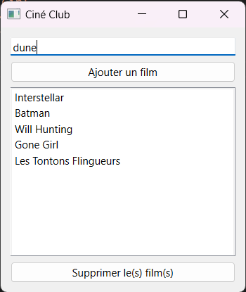

# Projet 13 : le ciné club (API et GUI)

L'objectif est de créer une application avec interface graphique grâce à **PySide** dans laquelle nous allons pouvoir stocker tous les films que l'on a visionné.

On devra également pouvoir en retirer un ou plusieurs à l'aide d'un bouton.

Les films visionnés seront stockés dans un fichier JSON qui servira de base de données.

## Aperçu de l'application

