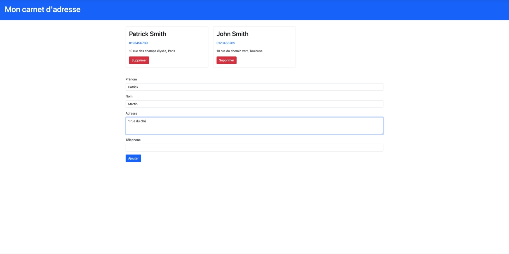

# Projet 17 : le gestionnaire d'utilisateurs (CRM) avec Django

On revient **une dernière fois** sur notre projet de gestionnaires d'utilisateurs, en y ajoutant cette fois **une interface web** avec le *framework* **Django**.

Cela vous permet de voir un autre projet avec **Django** et de voir à quel point Python est puissant et nous permet d'utiliser le code que l'on a fait précédemment de différentes façons.

**À partir de la même base de code**, l'API que nous avons créé dans la partie sur l'orienté objet, nous pouvons créer un programme en ligne de commande, une application de bureau avec interface graphique et une application web.

On aborde un peu de HTML et CSS à la fin, mais c'est très rapide et je vous montre la bibliothèque **Bootstrap** qui permet de se simplifier grandement la vie et d'avoir un résultat très plaisant avec très peu de connaissances en HTML et CSS.

Voici un petit aperçu de l'interface web que nous allons créer ensemble dans les prochaines parties :

